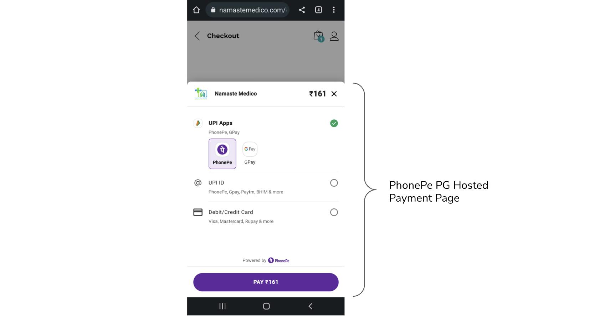
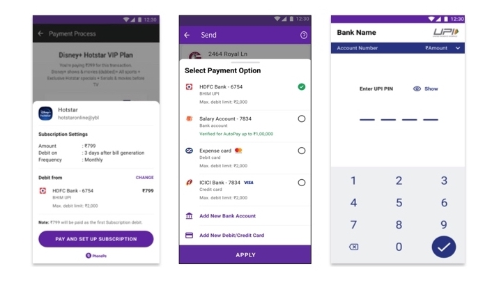
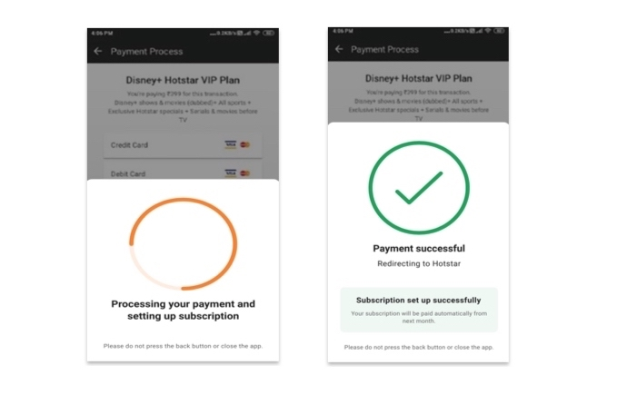

## Unofficial PhonePe PHP SDK
This is an unofficial PHP SDK for the [PhonePe API](https://developer.phonepe.com/docs). It is a work in progress and is not yet ready for production use.

In short, PhonePe Gateway provides the following four payment solutions. Let's view the images below to understand the flow of each payment solution.
 ### [x] PG Standard Checkout (Done)
 - PhonePe provides a Standard Checkout page that is hosted by PhonePe PG. This handles payment information and processing for UPI, Cards, and Netbanking payment methods. PhonePe PG Hosted Checkout Page is PCI DSS compliant.
 

 ### [ ] PG Custom Checkout (Pending)
 - PhonePe provides an option for merchants who have their own checkout page and want PhonePe PG to process payments via various payment methods like UPI, Cards, and Netbanking. This is a simple API-based integration where the merchant can call the PhonePe PG API and get the payment processed.
 

 ### [ ] Recurring Payments (Pending)
 - Kind of subscription/e-mandate for recurring payments.



 ### [ ] Android PG SDK (Unplanned)
 - As the name suggests, this is an SDK for Android Apps.

## Contributing
Pull requests are more than welcome. Since I am using Standard Checkout, I am creating that; however, since the structure is already ready, you can create other payment methods as well.

If you are using any other payment methods, please create a pull request with your solution, and I will merge it.

## Installation
```bash
composer require imlolman/phonepe-php-sdk
```

## Usage

### Standard Checkout

- Creating a Transaction
```php
<?php

require 'vendor/autoload.php';

use PhonePe\PhonePe;

// Below are the Test Details for Standard Checkout UAT, you can get your own from PhonePe Team. Make sure to keep the Salt Key and Salt Index safe (in environment variables or .env file).
$phonepe = PhonePe::init(
    "PGTESTPAYUAT86", // Merchant ID
    "MUID123", // Merchant User ID
    "96434309-7796-489d-8924-ab56988a6076", // Salt Key
    "1", // Salt Index
    "https://webhook.site/f7b80fd4-dc89-49a5-b569-d9d0a10b19c8", // Redirect URL, can be defined on per transaction basis
    "https://webhook.site/f7b80fd4-dc89-49a5-b569-d9d0a10b19c8", // Callback URL, can be defined on per transaction basis
    "DEV" // or "PROD"
);


$amountInPaisa = 100; // Amount in Paisa
$userMobile = "9999999999"; // User Mobile Number
$transactionID = "MERCHANT".rand(100000, 999999); // Transaction ID to track and identify the transaction, make sure to save this in your database.

$redirectURL = $phonepe->standardCheckout()->createTransaction($amountInPaisa, $userMobile, $transactionID)->getTransactionURL();

// You can also define the redirect and callback URL on per transaction basis
// $redirectURL = $phonepe->standardCheckout()->createTransaction($amountInPaisa, $userMobile, $transactionID, "https://webhook.site/f7b80fd4-dc89-49a5-b569-d9d0a10b19c8", "https://webhook.site/f7b80fd4-dc89-49a5-b569-d9d0a10b19c8")->getTransactionURL();

echo "Redirect URL: ".$redirectURL.PHP_EOL;
header("Location: ".$redirectURL);
```

- Validating a Transaction from webhook callback
```php
<?php

require 'vendor/autoload.php';

use PhonePe\PhonePe;

// Below are the Test Details for Standard Checkout UAT
$phonepe = PhonePe::init(
    "MERCHANTUAT", // Merchant ID
    "MUID123", // Merchant User ID
    "099eb0cd-02cf-4e2a-8aca-3e6c6aff0399", // Salt Key
    "1", // Salt Index
    "https://webhook.site/f7b80fd4-dc89-49a5-b569-d9d0a10b19c8", // Redirect URL
    "https://webhook.site/f7b80fd4-dc89-49a5-b569-d9d0a10b19c8", // Callback URL
    "DEV" // or "PROD"
);

$phonepe->standardCheckout()->getTransactionResponse(); // Returns Transaction Response Array after validating if the transaction is from PhonePe

$phonepe->standardCheckout()->getTransactionID(); // Returns Transaction ID

$phonepe->standardCheckout()->getTransactionStatus(); // [
//     "PAYMENT_SUCCESS",
//     "BAD_REQUEST",
//     "AUTHORIZATION_FAILED",
//     "INTERNAL_SERVER_ERROR",
//     "TRANSACTION_NOT_FOUND",
//     "PAYMENT_ERROR",
//     "PAYMENT_PENDING",
//     "PAYMENT_DECLINED",
//     "TIMED_OUT",
// ]

$phonepe->standardCheckout()->isTransactionSuccess(); // Returns true if transaction is successful, false otherwise.
```

- Validating a Transaction using Transaction ID
```php
<?php

require 'vendor/autoload.php';

use PhonePe\PhonePe;

// Below are the Test Details for Standard Checkout UAT
$phonepe = PhonePe::init(
    "MERCHANTUAT", // Merchant ID
    "MUID123", // Merchant User ID
    "099eb0cd-02cf-4e2a-8aca-3e6c6aff0399", // Salt Key
    "1", // Salt Index
    "https://webhook.site/f7b80fd4-dc89-49a5-b569-d9d0a10b19c8", // Redirect URL
    "https://webhook.site/f7b80fd4-dc89-49a5-b569-d9d0a10b19c8", // Callback URL
    "DEV" // or "PROD"
);

$transactionId = "MERCHANT123456"; // Transaction ID

$phonepe->standardCheckout()->getTransactionResponseByTransactionId($transactionId); // Returns Transaction Response Array after validating if the transaction is from PhonePe

$phonepe->standardCheckout()->getTransactionIDByTransactionId($transactionId); // Returns Transaction ID

$phonepe->standardCheckout()->getTransactionStatusByTransactionId($transactionId); // [
//     "PAYMENT_SUCCESS",
//     "BAD_REQUEST",
//     "AUTHORIZATION_FAILED",
//     "INTERNAL_SERVER_ERROR",
//     "TRANSACTION_NOT_FOUND",
//     "PAYMENT_ERROR",
//     "PAYMENT_PENDING",
//     "PAYMENT_DECLINED",
//     "TIMED_OUT",
// ]

$phonepe->standardCheckout()->isTransactionSuccessByTransactionId($transactionId); // Returns true if transaction is successful, false otherwise.
```